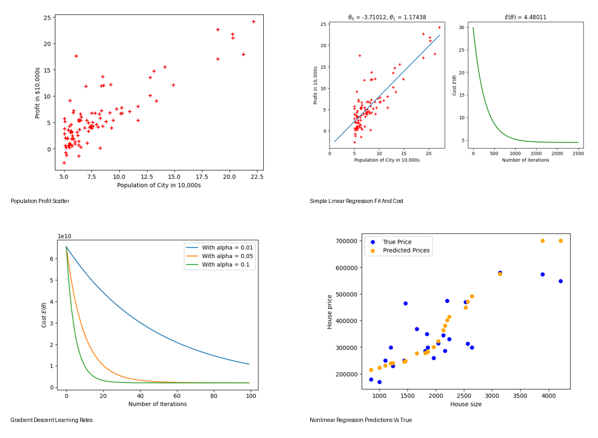

# Machine Learning Regression Experiments

**Author:** Dorsa Norouzi  
**Project Type:** Portfolio Demo / Machine Learning Practice  
**Year:** 2026

## Project Overview

This repository contains applied machine learning regression experiments covering simple linear regression, multiple linear regression, and nonlinear kernel regression.

The project demonstrates both from-scratch implementation using NumPy and library-based comparison using scikit-learn. The notebooks focus on core regression concepts such as cost functions, gradient descent, feature scaling, normal equation, Gaussian kernels, model prediction, and train/test evaluation.

## Result Preview



## Notebooks

| Notebook | Focus |
|---|---|
| `linear_regression_one_feature_experiment.ipynb` | Simple linear regression, MSE cost, gradient descent, predictions, scikit-learn comparison |
| `multiple_linear_regression_experiment.ipynb` | Multiple-feature regression, feature scaling, learning-rate comparison, normal equation, scikit-learn workflow |
| `nonlinear_kernel_regression_experiment.ipynb` | Gaussian-kernel regression, gamma sensitivity, train/test evaluation, Kernel Ridge Regression |

## Methods and Concepts

- Linear regression with one feature
- Multiple linear regression
- Feature normalization / standardization
- Mean squared error cost function
- Vectorized gradient computation
- Batch gradient descent
- Normal equation
- Gaussian kernel regression
- Nadaraya-Watson estimator
- Kernel Ridge Regression
- Train/test evaluation
- scikit-learn comparison

## Key Results

- Implemented simple linear regression from scratch and compared the learned parameters with scikit-learn.
- Predicted profit for new population values using both a custom regression implementation and scikit-learn.
- Applied multiple linear regression to housing-price prediction using feature scaling and gradient descent.
- Compared gradient descent with the normal equation for multiple linear regression.
- Explored nonlinear regression using a Gaussian-kernel estimator and evaluated prediction behavior for different gamma values.
- Trained and evaluated a scikit-learn Kernel Ridge Regression model on a train/test split.

## Results Included

The `results/` folder includes selected visual outputs from the experiments:

- `population_profit_scatter.png`
- `simple_linear_regression_fit_and_cost.png`
- `housing_original_features_scatter.png`
- `housing_normalized_features_scatter.png`
- `gradient_descent_learning_rates.png`
- `nonlinear_regression_gamma_sensitivity.png`
- `nonlinear_regression_predictions_vs_true.png`

## Dataset Note

The raw dataset files are not included in this repository. The notebooks expect the following local files if the experiments are rerun:

- `datasets/PopulationProfit.csv`
- `datasets/housing-dataset.csv`
- `datasets/ex1data2.txt`

The repository includes `datasets/README.md` to document the expected data structure without redistributing course-provided raw data files.

## How to Run

1. Clone the repository.
2. Install the required packages:

```bash
pip install -r requirements.txt
```

3. Add the required dataset files locally inside the `datasets/` folder.
4. Open the notebooks in Jupyter Notebook, JupyterLab, VS Code, or Google Colab.
5. Run the notebooks cell by cell.

## Requirements

Main Python libraries used:

- NumPy
- Matplotlib
- scikit-learn
- Jupyter

## Portfolio Note

This repository is a cleaned portfolio version of academic machine learning practice notebooks. The focus is on demonstrating regression fundamentals, implementation logic, model evaluation, and clear technical documentation.

## Usage and Copyright

© 2026 Dorsa Norouzi. All rights reserved.

This repository is shared as a portfolio project for recruitment, evaluation, and learning review purposes.

No license is granted for copying, modifying, redistributing, republishing, or using this work for commercial purposes or academic submission without prior written permission from the author.
